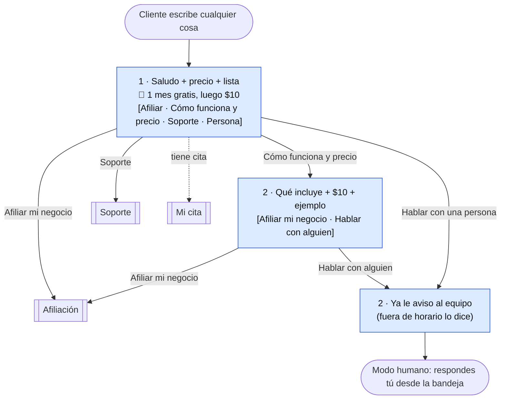
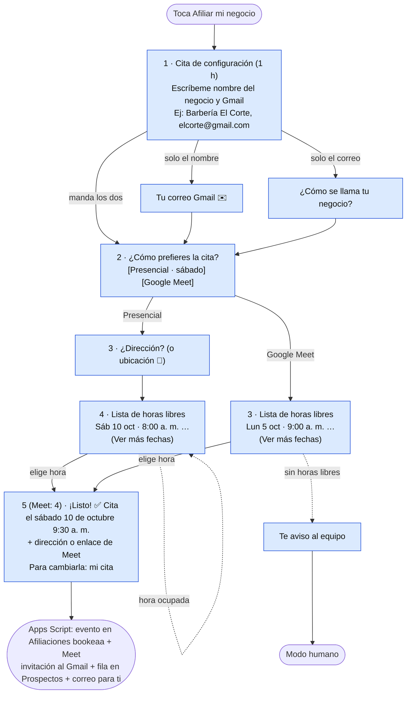
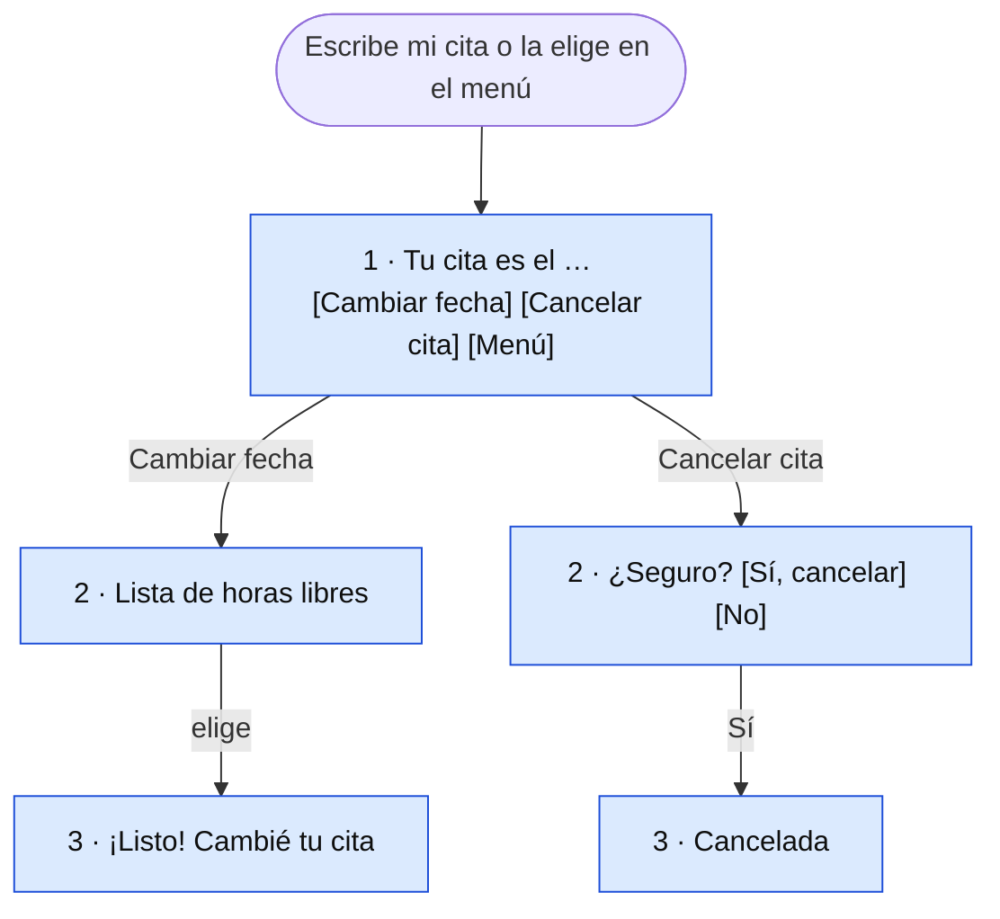
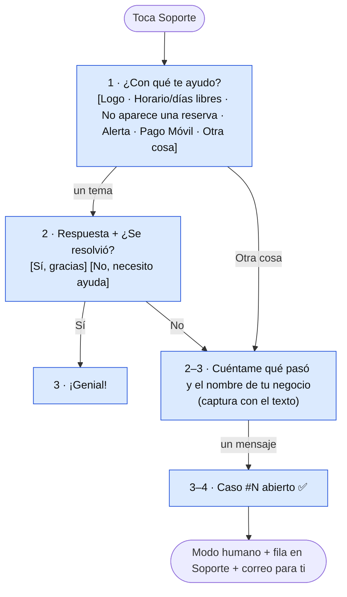

# Flujos del bot de WhatsApp

Cada caja azul es **un mensaje del bot**. Cada uno cuenta para los **1.000 mensajes gratis al mes**, y después cuesta ≈ $0,0113. Los mensajes del cliente no cuentan.

Reglas del bot:
- **un mensaje por turno**;
- en la afiliación pide solo lo mínimo para **agendar la cita de configuración**. Servicios, precios, duración, horario y logo los tomas tú en la cita.

## Mensajes por flujo

Conteo completo, desde el primer "hola" (incluye el menú):

| Flujo | Antes | Ahora |
|---|---|---|
| Afiliar · presencial (sábado) | 13 | **6** |
| Afiliar · Google Meet | 12 | **5** |
| Cómo funciona y precio | 2–3 (precio y "cómo funciona" por separado) | **2** |
| Soporte que se resuelve solo | 6 | **4** |
| Soporte con caso abierto | 8 | **5** |
| Hablar con una persona | 2 | **2** |

Con 1.000 mensajes gratis al mes, antes alcanzaban para unas **75 afiliaciones** y ahora para unas **170–200**.

"Precios y prueba gratis" ya no es una opción del menú. La prueba gratis **es** la afiliación (primer mes gratis), y el precio va en el saludo y en "Cómo funciona y precio".

## Menú (siempre primero)

## Afiliar mi negocio

- Elegir la hora **es** confirmar: ya no hay resumen ni "Corregir", un mensaje menos.
- La lista muestra día y hora juntos (hasta 9 opciones, más "Ver más fechas"), en vez de elegir primero el día y después la hora.

## Mi cita

## Soporte

## Siempre
- **"menú"** vuelve al inicio desde cualquier punto, también si un humano está atendiendo.
- **Modo humano**: el bot no contesta (0 mensajes) hasta que toques "Devolver al bot" o "Cerrar caso" en la bandeja. También vuelve solo al bot si pasan 24 h sin mensajes.
- **Texto que no entiende**: un mensaje: "Toca una de las opciones…" o el menú.
